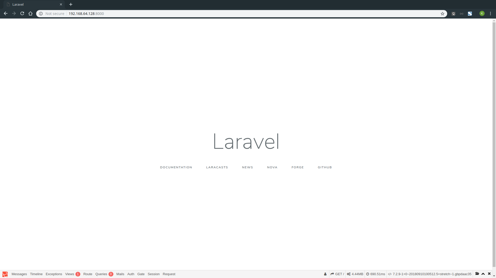

# Installation de Laravel

Ce guide suppose que vous possédez déjà [`composer`](https://getcomposer.org/), outil permettant de télécharger et d'installer des paquets dîts `package` pour les projets PHP, nottament au travers du site [`Packagist`](https://packagist.org/).

**UTILISATION DE COMPOSER**

Afin de créer un projet en utilisant composer, vous devez utiliser la commande :

``` bash
composer create-project [auteur/paquet] [dossier]
```

**CAS PRATIQUE**

Dans ce guide, notre projet Laravel se situera dans le dossier `/var/www/html/blog`. Il est donc nécessaire d'effectuer les commandes :

```bash
cd /var/www/html
composer create-project laravel/laravel blog
```

**EXPLICATIONS**

Lors de l'utilisation de la commande `composer create-project`, composer s'occupe de :
- Chercher et télécharger le paquet `laravel/laravel` et ses dépendances
- Copier le fichier `.env.example` en `.env`
- Générer une clé d'application `APP_KEY` et l'insérer dans le fichier `.env`


# Installation de la debugbar

[PHP DebugBar](http://phpdebugbar.com/) est un paquet créé par la communautée de PHP qui à pour but d'aider au développement en fournissant de nombreuses informations sur l'environnement de PHP, les requêtes SQL exécutés, le temps d'exécution et d'autres informations utiles.

En cherchant sur le site [Packagist](https://packagist.org/), on peut trouver un paquet nommé `laravel-debugbar`, créé par `barryvdh` mettant en place cette debugbar dans un projet Laravel. Nous allons installer et utiliser cette debugbar das notre projet, mais uniquement en développement.

**UTILISATION DE COMPOSER**

Afin d'ajouter un paquet pour projet, nous pouvons utiliser la commande :

```bash
composer require [auteur/paquet] (--dev)
```

**CAS PRATIQUE**

Nous souhaitons installer le paquet `laravel-debugbar` pour notre projet, mais uniquement en tant que dépendance de développement. Il est donc nécessaire d'effectuer les commandes :

```bash
cd /var/www/html/blog
composer require barryvdh/laravel-debugbar --dev
```

**EXPLICATIONS**

Lors de l'utilisation de la commande `composer require`, composer s'occupe de :
- Chercher et télécharger le paquet `barryvdh/laravel-debugbar` et ses dépendances
- Ajouter cette dépendance dans le fichier `composer.json`, dans la partie **dépendance du développement**

Lorsque nous mettrons notre projet en production, nous n'enverrons que les dossiers spécifique à Laravel. Le dossier `vendor` qui contient toutes les dépendances pour faire fonctionner Laravel (et nos paquets supplémentaires) peut être retélécharger depuis le site officiel. Il n'est donc pas nécessaire de l'inclure.

Lorsque nous sommes en production, il n'est pas nécessaire de télécharger les dépendances relatives au développement, allégeant ainsi notre site une fois en production.

# Lancement du serveur interne

Lors du développement, et afin de nous faciliter la tâche, nous n'utiliserons pas de serveur web autre que celui intégré à PHP.

Laravel dispose d'un outil en ligne de commande, nommé `Artisan` qui permet - *entre autres* - de lancer ce serveur avec les bons paramètres.

[Pour en savoir plus sur `Artisan`, veuillez consulter la documentation.](https://laravel.com/docs/5.7/artisan)

**CAS PRATIQUE**

Nous souhaitons lancer notre serveur à l'aide d'`Artisan`. Il est donc nécessaire d'effectuer les commandes :

```bash
cd /var/www/html/blog
php artisan serve --host 192.168.64.128 --port 8000
```

**ATTENTION : L'adresse IP privée de votre machine n'est probablement pas `192.168.64.128` !**

**EXPLICATIONS**

Lors de l'utilisation de la commande `php artisan serve`, `artisan` se charge de 
- Lancer le serveur interne de PHP sur l'adresse IP `192.168.64.128` grâce au paramètre `--host 192.168.64.128`
- Lancer le serveur interne de PHP sur le port `8000` grâce au paramètre `--port 8000`
- Rediriger toutes les requêtes effectuées sur cette adresse IP et ce port sur le bon fichier PHP 

# Edition du fichier de configuration

Toute la configuration de votre projet Laravel devrait se situer dans le fichier `.env` créé automatiquement lors de l'installation de votre projet. (*Si ce n'est pas le cas, copiez le fichier `.env.example` en `.env`*).

Ce fichier contient des informations sur l'environnement de votre projet : il peut s'agir notamment des informations sur le nom de votre application, son état (local / production), le mode debug, la configuration de votre base de donnée, du serveur e-mail, etc...

Les lignes qui nous intéressent pour le moment sont celles relatives au :
- status de l'application `APP_ENV`, qui doit être `local`
- status du mode debug `APP_DEBUG`, qui doit êtree `true`
- aux lignes de la base de donnée, qui doivent correspondre à votre serveur de base de donnée :

```php
DB_CONNECTION=mysql
DB_HOST=127.0.0.1
DB_PORT=3306
DB_DATABASE=blog
DB_USERNAME=root
DB_PASSWORD=root
```

# Vérification du fonctionnement

Si l'installation s'est bien effectuée, vous devriez pouvoir vous rendre à l'aide de votre navigateur sur l'adresse `http://192.168.64.128:8000` et voir cette page s'afficher :



**REMARQUES**

- La page de bienvenue de Laravel se charge bien
- La debugbar est bien présente en bas de la page
