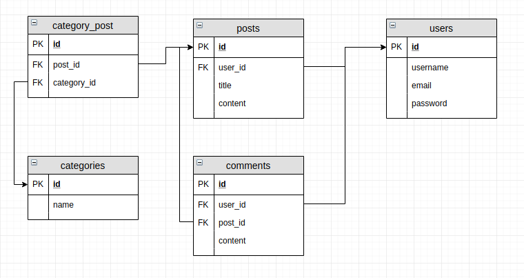

# Conception de la BDD

Avant de commencer notre projet de développement, il est nécessaire de mettre en place une base de donnée.

**NOTRE PROJET**

Le projet consiste à créer un blog :
- un blog contient plusieurs articles
- chaque article est écrit par 1 utilisateur
- chaque article peut comporter 0, 1 ou plusieurs commentaires
- chaque article peut appartenir à 0, 1 ou plusieurs catégories



Afin de générer notre base de donnée, nous allons utiliser le système de migration inclu à Laravel.

# Création de la BDD

**QUE SONT LES MIGRATIONS ?**

Les migrations sont des fichiers comportant du code permettant la gestion des tables d'une base de donnée. Elles permettent l'évolution de celle-ci au cours du projet (*création, modification, suppression*). La présence des migrations facilite également le partage et l'installation du projet puisque l'utilisation de fichiers SQL n'est plus requis.

**UTILISATIONS DES MIGRATIONS**

Les fichiers de migrations se situent dans le dossier `database/migrations`. Par défaut, 2 migrations sont présentes et permettent au système d'authentification de base de Laravel de fonctionner. 1 migration correspond à 1 table de notre modèle de donnée.

Afin de générer des fichiers de migrations, nous pouvons utiliser l'outil `Artisan` grâce à la commande :

```bash
php artisan make:migration [create_nomdelatable_table]
```

où `nomdelatable` doit être remplacé par le nom de la table que vous souhaitez générer.

**ATTENTION: L'odre des fichiers est important. Il est impossible de générer des contraintes d'intégrités (*clés étrangères*) si la table n'a pas été créée précédement.**

Cette commande générera un fichier qui se trouvera ici : `database/migrations/date_heure_create_nomdelatable_table.php`

```php
class CreateNomdelatableTable extends Migration
{
	/**
	 * Run the migrations.
	 *
	 * @return void
	 */
	public function up()
	{
		Schema::create('nomdelatable', function (Blueprint $table) {
			$table->increments('id');
			$table->timestamps();
		});
	}

	/**
	 * Reverse the migrations.
	 *
	 * @return void
	 */
	public function down()
	{
		Schema::dropIfExists('nomdelatable');
	}
}

```

**EXPLICATIONS**

Ce fichier contient 2 méthodes : `up()` et `down()`. 
- La méthode `up()` sera exécuté lors de la commande `php artisan migrate` et se chargera de générer la table `nomdelatable`.
- La méthode `down()` sera exécuté lors de la commande `php artisan migrate:rollback` et se chargera de supprimer la table `nomdelatable` si elle existe.

* `Schema` est la classe interne à Laravel qui gère la base de donnée.
* `$table` est la variable qui permettera d'intéragire avec la table créé afin de générer des champs.

De base, pour toutes les tables générées, Laravel génère :
- 1 champ `id` de type `entier non signé, auto-incrément`
- 1 champ `created_at` de type `timestamp`
- 1 champ `updated_at` de type `timestamp`


**CAS PRATIQUE**

Pour notre projet, nous devons générer 5 tables : `users`, `posts`, `comments`, `categories`, `category_post`. Il est donc nécessaire d'effectuer les commandes : 


```bash
php artisan make:migration create_users_table
php artisan make:migration create_posts_table
php artisan make:migration create_comments_table
php artisan make:migration create_categories_table
php artisan make:migration create_category_post_table
```

# Ajout de champs

Afin de rajouter des champs dans nos table, il est nécessaire de modifier la méthode `up()` de chacun des fichiers de migrations créés.

**QUELS SONT LES CHAMPS POSSIBLES ?**

[La documentation de Laravel](https://laravel.com/docs/5.7/migrations#creating-columns) propose un tableau qui répertorie tous les champs utilisables, avec explications et exemples.

**CAS PRATIQUE**

`databases/migrations/2018_10_15_000000_create_users_table.php` :
```php
public function up()
{
	Schema::create('users', function(Blueprint $table) {
		$table->increments('id');
		$table->string('username');
		$table->string('email');
		$table->string('password');
		$table->timestamps();
	});
}
```

`databases/migrations/2018_10_15_000001_create_posts_table.php` :
```php
public function up()
{
	Schema::create('posts', function(Blueprint $table) {
		$table->increments('id');

		$table->unsignedInteger('user_id');
		$table->foreign('user_id')->references('id')->on('users');

		$table->string('title');
		$table->text('content');
		$table->timestamps();
	});
}
```

`databases/migrations/2018_10_15_000002_create_comments_table.php` :
```php
public function up()
{
	Schema::create('comments', function(Blueprint $table) {
		$table->increments('id');

		$table->unsignedInteger('user_id');
		$table->foreign('user_id')->references('id')->on('users');

		$table->unsignedInteger('post_id');
		$table->foreign('post_id')->references('id')->on('posts');

		$table->text('content');
		$table->timestamps();
	});
}
```

`databases/migrations/2018_10_15_000003_create_categories_table.php` :
```php
public function up()
{
	Schema::create('categories', function(Blueprint $table) {
		$table->increments('id');
		$table->string('name');
		$table->timestamps();
	});
}
```
`databases/migrations/2018_10_15_000004_create_category_post_table.php` :
```php
public function up()
{
	Schema::create('category_post', function(Blueprint $table) {
		$table->increments('id');

		$table->unsignedInteger('category_id');
		$table->foreign('category_id')->references('id')->on('categories');

		$table->unsignedInteger('post_id');
		$table->foreign('post_id')->references('id')->on('posts');
	});
}
```

**EXPLICATIONS**

- Remarquez la date : les migrations ont été renomés afin de les effectuer dans un ordre correct
- Chacune de nos table possède en clé primaire un identifiant auto-incrément
- Chacune de nos table possède es champs `created_at` et `updated_at`
- Les clés étrangères font références aux clés primaires qui sont des entiés non-signés, d'où `unsignedInteger`
- On déclare les clés étrangères tel que : le champ `X` fait référence au champ `Y` de la table `Z`

# Lancement des migrations

Maintenant que toutes nos migrations sont prêtes, nous pouvons utiliser l'outil `Artisan` afin d'effecuter toutes les migrations.

**CAS PRATIQUE**

```bash
php artisan migrate:fresh
```

**EXPLICATIONS**

L'utilisation de `:fresh` permet de spécifier à Laravel que l'on souhaite supprimer toutes les tables actuellement présentes dans la base de donnée spécifiée dans notre fichier `.env`.