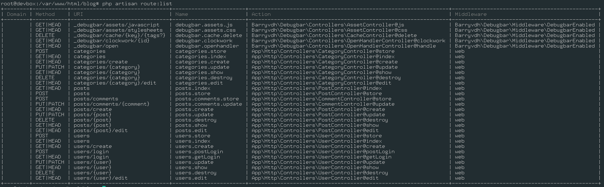

# Les Routes

**QU'EST-CE QU'UNE ROUTE ?**

Une `Route` définie la manière d'accéder à une ressource de notre application. Le `Routeur` permet de faire le lien entre l'`URL` qu'utilise notre utilisateur et une page qui lui sera renvoyé.

**FONCTIONNEMENT DES ROUTES**

Afin de définir une `Route`, nous avons besoin de 2 choses :

- l'adresse de la page que visitera notre utilisateur (*http://example.com/posts/1*)
- la méthode HTTP utilisé (*GET, POST, PUT, PATCH, DELETE*)

**APPLICATION RESTful**

Beaucoup de site internet - et particulièrement les différentes API - utilisent la métode REST afin de rendre leurs routes intuitives : l'action voulu est définie par la méthode HTTP utilisée.

| METHODE HTTP | UTILITÉ                       |
| ------------ | ----------------------------- |
| GET          | Récupère une ressource        |
| POST         | Ajoute une nouvelle ressource |
| PUT\|PATCH   | Modifie une ressource         |
| DELETE       | Supprime une ressource        |

En utilisant cette convention, il devient alors simple de générer des URLs prédictibles pour notre application lorsqu'il s'agit d'opérations CRUD (*Create, Read, Update, Delete*).

**CAS PRATIQUE**

Dans notre cas, nous aurons besoin des routes suivantes :

`ARTICLES`

| HTTP   | URL          | Action                                    |
| ------ | ------------ | ----------------------------------------- |
| GET    | /            | Affiche une liste d'articles              |
| GET    | /create      | Affiche un formulaire d'ajout d'article   |
| GET    | /{post}      | Affiche un article précis                 |
| GET    | /{post}/edit | Affiche un formulaire d'édition d'article |
| POST   | /            | Ajoute un nouvel article                  |
| PATCH  | /{post}      | Modifie un article existant               |
| DELETE | /{post}      | Supprime un article existant              |

`COMMENTAIRES`

| HTTP   | URL                       | Action                                      |
| ------ | ------------------------- | ------------------------------------------- |
| POST   | /{post}/comment           | Ajoute un nouveau commentaire sur l'article |
| PATCH  | /{post}/comment/{comment} | Modifie le commentaire sur l'article        |
| DELETE | /{post}/comment/{comment} | Supprime le commentaire sur l'article       |

`CATEGORIES`

| HTTP   | URL                         | Action                                       |
| ------ | --------------------------- | -------------------------------------------- |
| GET    | /categories                 | Affiche une liste de categories              |
| GET    | /categories/create          | Affiche un formulaire d'ajout de catégorie   |
| GET    | /categories/{category}      | Affiche une catégorie précise                |
| GET    | /categories/{category}/edit | Affiche un formulaire d'édition de catégorie |
| POST   | /categories                 | Ajoute une nouvelle catégorie                |
| PATCH  | /categories/{category}      | Modifie la catégorie                         |
| DELETE | /categories/{category}      | Supprime la catégorie                        |

`UTILISATEURS`

| HTTP   | URL            | Action                                 |
| ------ | -------------- | -------------------------------------- |
| GET    | /login         | Affiche le formulaire de connexion     |
| POST   | /login         | Connecte l'utilisateur                 |
| GET    | /register      | Affiche le formulaire d'enregistrement |
| POST   | /register      | Enregistre le nouvel utilisateur       |
| GET    | /users         | Affiche la liste des utilisateurs      |
| PATCH  | /users/{users} | Modifie l'utilisateur                  |
| DELETE | /users/{users} | Supprime l'utilisateur                 |

# Utilisation des Routes dans Laravel

Laravel dispose de 2 fichiers afin de définir les différentes routes de votre applications : 

- `routes/api.php` permettant de définir les routes pour : `example.com/api/...`
- `routes/web.php` permettant de définir les routes pour : `example.com/...`

Afin de créer une nouvelle route, il suffit d'ajouter :

```php
Route::method('/url', function() {
    return "Hello World!";
});
```

C'est également les routes qui permettent d'appeler le contrôleur directement :

```php
Route::method('/url2', 'MonController@maMethode');
```

**EXPLICATIONS**

- Il faut remplacer `method` par get, post, put, patch ou delete
- La route ne répondera que sur `/url`
- Lorsque l'utilisateur ira sur `/url` en utilisant la bonne métode, Laravel retournera "Hello World" - c'est-à-dire lui envera une page HTML contenant Hello World
- Lorsque l'utilisateur ira sur `/url2` en utilisant la bonne méthode, Laravel chargera le contrôleur `MonController` et utilisera la méthode `maMethode` de ce contrôleur. Celui-ci pourra, par exemple, retourner Hello World, une vue, du JSON, ...

Il existe des manières de regrouper les différentes Routes, n'hésitez-pas à aller voir [la documentation de Laravel](https://laravel.com/docs/5.7/routing)

**CAS PRATIQUE**

Voici les différentes routes présentes dans le fichier `routes/web.php` :

```php
Route::group(["as" => "users."], function() {
    // Login
    Route::get("/login", "UserController@getLogin")->name('login');
    Route::post("/login", "UserController@postLogin");


    // Create
    Route::get("/register", "UserController@create")->name('create');
    Route::post("/register", "UserController@store")->name('store');

    // Read
    Route::get("/users", "UserController@index")->name('index');
    Route::get("/users/{user}", "UserController@show")->name('show');

    // Update
    Route::get("/users/{user}/edit", "UserController@edit")->name('edit');
    Route::patch("/users/{user}", "UserController@update")->name('update');

    // Delete
    Route::delete("/users/{user}", "UserController@destroy")->name('destroy');
});

// Posts-related routes
Route::group(["as" => "posts."], function() {
    // Create
    Route::get("/create", "PostController@create")->name('create');
    Route::post("/", "PostController@store")->name('store');

    // Read
    Route::get("/", "PostController@index")->name('index');
    Route::get("/{post}", "PostController@show")->name('show');

    // Update
    Route::get("/{post}/edit", "PostController@edit")->name('edit');
    Route::patch("/{post}", "PostController@update")->name('update');

    // Delete
    Route::delete("/{post}", "PostController@destroy")->name('destroy');

    // Comments-related routes
    Route::group(["as" => "comments."], function() {
        // Create
        Route::post("/", "CommentsController@store")->name('store');

        // Update
        Route::patch("/{comment}", "CommentsController@update")->name('update');

        // Delete
        Route::delete("/{comment}", "CommentsController@destroy")->name('destroy');
    });
});

// Categories-related routes
Route::group(["as" => "categories."], function() {
    // Create
    Route::get("/create", "CategorieController@create")->name('create');
    Route::post("/", "CategorieController@store")->name('store');

    // Read
    Route::get("/", "CategorieController@index")->name('index');
    Route::get("/{category}", "CategorieController@show")->name('show');

    // Update
    Route::get("/{category}/edit", "CategorieController@edit")->name('edit');
    Route::patch("/{category}", "CategorieController@update")->name('update');

    // Delete
    Route::delete("/{category}", "CategorieController@destroy")->name('destroy');
});
```

**EXPLICATIONS**

- Nous avons regrouper les différentes Routes dans 3 groupes :
  * le groupe `categories`
  * le groupe `posts`
  * le group `users`

Cette séparation permet :
- d'avoir une meilleure organisation de nos routes : toutes les routes permettant d'accéder à une ressource sons regroupés à 1 endroit.
- de pouvoir définir un "préfix d'URL" pour le groupe : on souhaite que toutes les URL se rapportant aux posts soient accessible par `example.com/posts/...`
- de pouvoir nommer toutes les routes du groupe : on souhaite que toutes les URL se rapportant aux posts aient pour nom `posts.(...)`.

**EXEMPLES**

En imaginant que l'URL de notre site soit `example.com`, si on souhaite accéder à un article précis :
- le nom de la route sera `posts.show`
- l'adresse à accéder sera `example.com/posts/{post}` où `{post}` est l'identifiant de l'article

# Améliorations

Définir manuellement tout les liens peut-être une manire d'apprendre a utiliser les routes. Cependant, sachant que notre application est principalement constitué de CRUD (*Create, Read, Update, Delete*), nous pouvons utiliser les [ressources](https://laravel.com/docs/master/controllers#resource-controllers) qui génèreront automatiquement les mêmes URLS et nom de route présentés précédemment.

**CAS PRATIQUE**

Notre routeur ressemble maintenant à :

```php
Route::group(["as" => "users.", "prefix" => "users"], function() {
    Route::get("/login", "UserController@getLogin")->name('getLogin');
    Route::post("/login", "UserController@postLogin")->name('postLogin');
});
Route::resource("users", "UserController");

Route::group(["as" => "posts.", "prefix" => "posts"], function() {
    Route::resource("comments", "CommentController")->only(["store", "update", "delete"]);
});
Route::resource("posts", "PostController");

Route::resource("categories", "CategoryController");
```

**EXPLICATIONS**

- Nous souhaitons ajouter les 2 routes pour la connexion dans le UserController
- Les commentaires sont des ressources liés aux articles, d'où leur présence dans le même groupe que `posts`.
- Nous souhaitons uniquement ajouter, modifier et supprimer les commentaires. Le formulaire sera présent directement sur l'article.

**REMARUQE**

Les contrôleurs n'existant pas encore, il est probable que Laravel vous affiche une erreur lorsque vous tentez d'accéder à l'une de ces routes, ou d'effectuer une commande avec `Artisan`.

# Liste des routes

En utilisant `Artisan`, il est possible d'obtenir la liste des routes enregistrés sur notre application :

```bash
php artisan route:list
```

