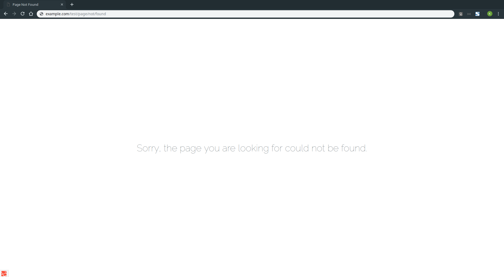

# LARAVEL - Mise en production d'un projet avec Nginx

Ce guide vous permettra de mettre en production un projet Laravel sur un serveur Web Nginx.

- [LARAVEL - Mise en production d'un projet avec Nginx](#laravel---mise-en-production-dun-projet-avec-nginx)
- [Pré-requis](#pr%C3%A9-requis)
- [ETAPE 01 - Installation du Projet Laravel](#etape-01---installation-du-projet-laravel)
- [ETAPE 02 - Configuration de Nginx](#etape-02---configuration-de-nginx)
- [ETAPE 03 - Tester la configurarion](#etape-03---tester-la-configurarion)

# Pré-requis

Afin de suivre ce guide, vous devez:
- Installer le paquet nginx
- Installer les paquets php nécessaires au fonctionnement de Laravel
- Posséder un projet Laravel (il peut s'agir de l'installation de base)
- Posséder un nom de domaine (dans notre exemple, il s'agira de `exemple.fr`)

# ETAPE 01 - Installation du Projet Laravel

Notre projet Laravel se situera dans le dossier `/var/www/html/laravel`

```bash
cd /var/www/html
composer create-project laravel/laravel laravel
```

# ETAPE 02 - Configuration de Nginx

La configuration des hôtes virtuels (Virtual Hosts) sur Nginx se situe dans le dossier `/etc/nginx/conf.d`

Créez un fichier dans ce dossier :
```bash
nano /etc/nginx/conf.d/exemple.fr.conf
```

Ce fichier contiendra la configuration suivante : 
```nginx
server
{
        listen 80;
        server_name exemple.fr;

        ## SERVER CONFIG
        root /var/www/html/laravel/public;

        index index.php index.html;

        # MAIN PAGE
        location / {
                try_files $uri $uri/ /index.php?$query_string;
        }

        # PHP support
        location ~ \.php$ {
                try_files $uri =404;
                fastcgi_pass unix:/run/php/php7.2-fpm.sock;
                fastcgi_index index.php;
                fastcgi_param SCRIPT_FILENAME $document_root$fastcgi_script_name;
                include fastcgi_params;
        }
}
```

**EXPLICATIONS**
- `listen 80` indique le port sur lequel la configuration est active
- `server_name exemple.fr` indique le nom de domaine sur lequel la configuration est active
- `root /var/www/html/laravel/public` indique le dossier dans lequel se situe notre projet. On souhaite que le visiteur atteigne immédiatement le dossier public.
- `index index.php index.html` indique à Nginx quels fichiers il doit tenter de charger
- `location /` indique la configuration spécifique lorsque le visiteur arrive sur le nom de domaine
- `try_files $uri $uri/ /index.php?$query_string` indique l'ordre des fichiers à charger*
- `location ~ \.php$` indique à Nginx la configuration spécifique aux fichiers PHP
- `fastcgi_pass unix:/run/php/php7.2-fpm.sock` indique le socket du serveur PHP


> EXEMPLE(*): \
> Lorsque l'utilisteur arrive sur `exemple.fr/admin/roles`, Nginx tentera:
> - De charger le fichier `roles` situé dans le dossier `admin`
> - De charger le dossier `roles` situé dans le dossier `admin`
> - De charger le fichier `index.php` en passant l'URL complète

Maintenant que la configuration de Nginx est complète, nous pouvons la recharger :
```bash
nginx -s reload
```

# ETAPE 03 - Tester la configurarion

Votre projet devrait maintenant être fonctionnel. \
Afin de vérifier votre configuration, essayer d'accéder à une page ne correspondant à aucune route, située dans un "sous-dossier" : `exemple.fr/test/page/not/found`

Si le message d'erreur est celle de Nginx, la configuration n'est pas correcte, si il s'agit de celle de Laravel, votre configuration est complète.


